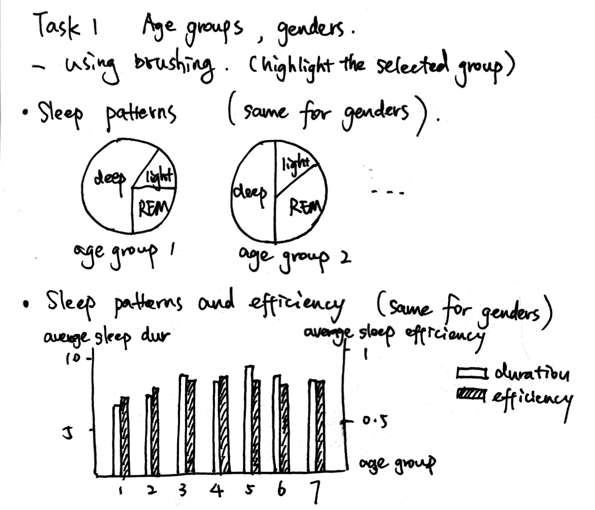
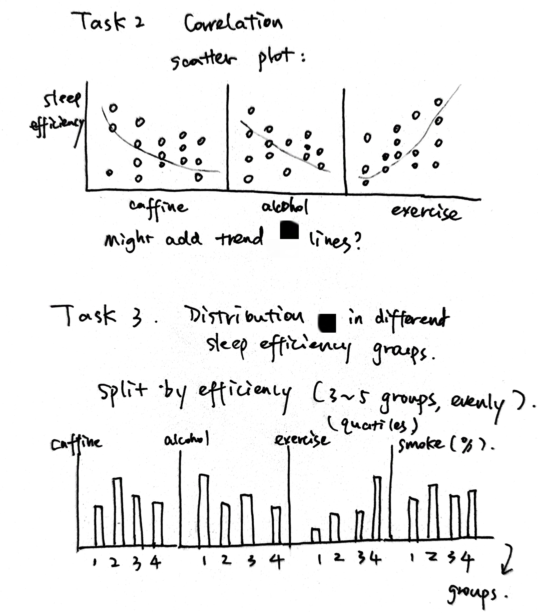

# Data Visualization Project

## Data

The data I propose to visualize for my project is *Sleep Efficiency Dataset*. Data source: https://www.kaggle.com/datasets/equilibriumm/sleep-efficiency, Vizhub: https://vizhub.com/YiwenLiebesleid/sleep_efficiency

### Description of the dataset

This dataset is about a study of sleep efficiency and sleep patterns, it contains information about a group of test subjects and their sleep patterns.

Each test subject is identified by a unique Subject ID and their age and gender are also recorded. The Bedtime and Wakeup time features indicate when each subject goes to bed and wakes up each day, and the Sleep duration feature records the total amount of time each subject slept in hours. The Sleep efficiency feature measures the proportion of time spent in bed that is spent asleep. The REM sleep percentage, Deep sleep percentage, and Light sleep percentage features indicate the time each subject spent in each stage of sleep. The Awakenings feature records the times each subject wakes up during the night. Additionally, the dataset includes information about each subject's caffeine consumption and alcohol consumption in the 24 hours before bedtime, their smoking status, and their exercise frequency.

### Attributes
- ID
- Age (ordered): (9, 69)
- Gender (categorical): 50% male and 50% female
- Bedtime
- Wakeup time
- Sleep duration (ordered): (5, 10)
- Sleep efficiency (ordered): (0.5, 0.99)
- REM sleep percentage (ordered): (15, 30)
- Deep sleep percentage (ordered): (18, 75)
- Light sleep percentage (ordered): (7, 63)
- Awakenings (ordered): (0, 4)
- Caffeine consumption (ordered): (0, 200)
- Alcohol consumption (ordered): (0, 5)
- Smoking status (categorical): (yes, no)
- Exercise frequency (ordered): (0, 5)

I will mainly focus on age, gender, sleep duration, sleep efficiency, XXX sleep percentage, and lifestyle attributes.

---

## Questions & Tasks

The following tasks and questions will drive the visualization and interaction decisions for this project:

 * How different age groups and genders vary in sleep patterns (XXX sleep percentage), sleep duration, and sleep efficiency.
 * Correlation between caffeine consumption, alcohol consumption, exercise frequency, and sleep efficiency. (i.e. correlation(caffeine, sleep efficiency), ...)
 * Understand the distribution of lifestyle attributes, and distribution of sleep patterns in different sleep efficiency groups.

---

## Sketches

<!-- 
 -->

The 1st sketch is related to Task 1, I consider using brushing in this viz, so when selecting one group then all the related plots are highlighted. It visualized the sleep pattern percentage of each age group or gender, and also the sleep patterns and efficiency of each age group or gender.

The 2nd sketch is related to Task 2 & 3. I'm thinking when selecting the efficiency group in task 3, all data related to this group should be highlighted in both T  ask 2 and 3. It visualized the correlation between each lifestyle and sleep efficiency, and also the distribution of these lifestyles in different sleep efficiency groups.

---

## Prototypes

I’ve created a proof of concept visualization of this data: 

- A pie chart showing the sleep pattern percentage distribution in age group 1 (9~19).
- A bar chart showing average sleep duration and efficiency in each age group.
- A scatter plot of the correlation(exercise, sleep efficiency).
- A bar chart for the caffeine consumption in each sleep efficiency group.

---

## Milestones

### Week 8: Pre-process Datasets
Link: https://vizhub.com/YiwenLiebesleid/processed_sleep_efficiency_dataset

I processed each data example to have an "age_group", and an "efficiency_group" with Python. The age group is mapped in this way: {1:9-19, 2:20-29, 3:30-39, 4:40-49, 5:50-59, 6:60-69}. 
The efficiency group is split into quartiles, therefore 4 groups are formed, larger group number means higher sleep efficiency.
I also processed the NaNs in the attributes into 0s.
Later I will use this processed dataset instead of the original one for visualization. 

### Week 9: Task 1 Pie Charts
Link: https://vizhub.com/YiwenLiebesleid/83bb0cc6abc648c4bd076ad9574cf7eb

I computed the average deep sleep, REM sleep, and light sleep percentages of each age group and gender, and translated them into pie charts that easily illustrate the sleep patterns 
(different sleep stage proportions) in each group. It shows how the sleep pattern varies from age group to age group, and also in different genders.

I also added color legends to the pie charts, and also interactions. 

Interaction:
- Toolkit buttons: the left top shows 2 buttons "Age" and "Gender", if you press one of them, the corresponding group results will be displayed.
- Hover: moving the mouse over the legend rectangles will only display the corresponding part in each pie chart.

### Week 10: Task 1 Bar Charts
Link: https://vizhub.com/YiwenLiebesleid/2c0712efb0ad4813aead97542e81f53c

I computed the average sleep duration and efficiency of each age group and gender, and translated them into bar charts. 
The yellow bars correspond to the left y-axis (duration), while the purple bars correspond to the right y-axis (efficiency).

This viz shows how sleep duration and efficiency vary in different age groups and genders. 
It seems that the distributions of age groups vary greatly, while gender has little effect on this distribution.

Interaction: 
- Toolkit buttons: the left top shows 2 buttons "Age" and "Gender", if you press one of them, the corresponding group results will be displayed.
- Hover: When moving the mouse onto one bar, all bars in the same chart of the same attribute (duration/efficiency) will display numbers. Also, if you move the mouse onto the legends, the bar charts will only
display the corresponding attribute (duration/efficiency) to better observe each attribute's trend.

### Week 11: Task 2 Scatter Plots
Link: https://vizhub.com/YiwenLiebesleid/24a05d8f436d44f388af4fd2ca5aedf4

I plot 3 scatter plots along with their trendlines to show the correlation between each lifestyle attribute and sleep efficiency.
1st plot: caffeine consumption - sleep efficiency. 2nd plot: alcohol consumption - sleep efficiency. 3rd plot: exercise times - sleep efficiency.
I also set color with interpolateViridis to strengthen the display of sleep efficiency (darker color means higher efficiency). 
From the visualization here, we can observe that the correlation between caffeine consumption and efficiency is small, while alcohol consumption and exercise times do have some impact on sleep efficiency: higher alcohol - lower efficiency; higher exercise - higher efficiency.

Interaction:
- It should be responsive to fit different screen sizes
- Hover:
  - If you move the mouse over the "Trendline" legend, it will highlight the 3 trendlines in the scatter plots, and display the equations.
  - If you move the mouse over any trendline in the scatter plot, (which should be with a low opacity in natural state), it will highlight this trendline and display its equation.

### Week 12: Task 3 bar charts
Link: https://vizhub.com/YiwenLiebesleid/2add5d94142440e8b86b4c46b5d02041

Link (v2): https://vizhub.com/YiwenLiebesleid/c71db0d850e84c6899d9b17af9b92acc

I computed the average caffeine and alcohol consumption _(todo: also add smoke and exercise)_ of each sleep efficiency group, and translated them into bar charts. 

This viz shows how the trend of lifestyle differs in different efficiency groups. For example:
- People in higher efficiency groups consume relatively more caffeine before sleep.
- People in higher efficiency groups consume significantly less alcohol.
- People in higher efficiency groups do more exercises on average.

Interaction:
- when moving the mouse onto one bar, all bars will display numbers of caffeine/alcohol. Also, if you move the mouse onto the legends, the bar charts will only display the corresponding attribute.

(Version 2) Interaction in this viz: when moving the mouse onto one bar, all bars will display the value of caffeine/alcohol/exercise (y-axis). The selected bar will be highlighted.

### Week 13: Add Interactions 

This week I added interactions to previous works as updated above.

Current works are collected in this article: https://vizhub.com/YiwenLiebesleid/6ebb1b5f7e804a95b0d4fe25710466b7

- Week 14: merge all the works together, may consider combine task 3 and task 4 so that the same attribute can be shown on the same page.

